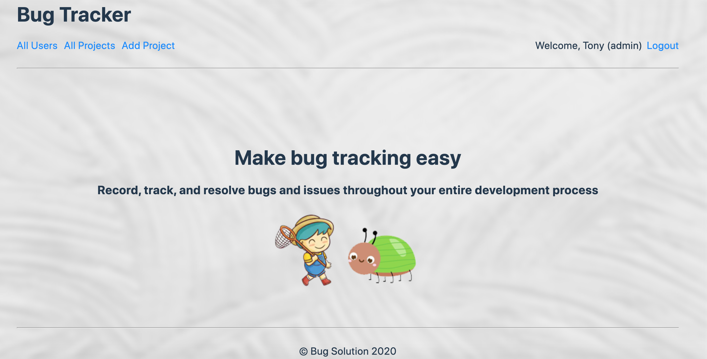

# BUG TRACKER

It is a Ruby on Rails project that makes bug tracking easy. Here is the link: https://bug-tracker-tg.herokuapp.com/

# IMAGE

# HOW TO USE
<ul>
  <li>
  A user needs to log in or sign up to be able to use this application  
  </li>
  <li>
  Amin(manager) can view all the projects and edit all the users who can only view their own projects  
  </li>
  <li>
  Amin and Users can create, update and delete projects and bugs  
  </li>
  <li>
  Please feel free to try out the accounts below, the first account is admin  
  </li>
  <li>
   email: tony@ga.com, password: chicken  
  </li>
  <li>
   email: person1@ga.com, password: chicken  
  </li>
  <li>
   email: person2@ga.com, passwrod: chicken  
 </li>
</ul>

# BUILT WITH

<ul>
<li>
Front-end: HTML5, CSS3  
</li>
<li>
Back-end: Ruby 2.4.1p111, Rails 5.2.4.1  
</li>
<li>
Database: PostgreSQL 12  
</li>
<li>
Deployed on Heroku  
</li>
</ul>

# TO DO LIST

<ul>
<li>
UX and UI  
</li>
<li>
Google Map API for addressing where the projects are from  
</li>
<li>
Image for bug(optional)  
</li>
</ul>
